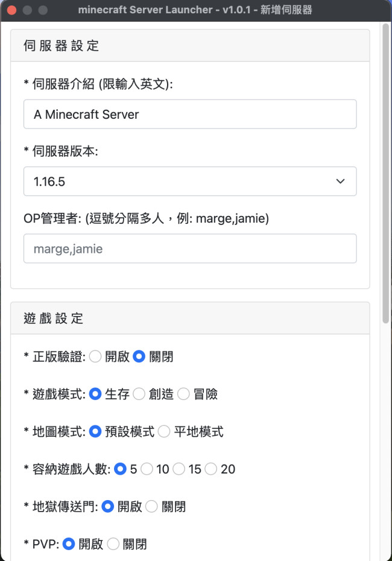

# minecraft Server Launcher

開箱即用的 minecraft server 啟動器 UI 管理介面

## 介紹

此啟動器是開發給家中二位國小生可以自行架設想玩的 minecraft 地圖而生的，如有需要安裝檔請至 Releases 頁面下載，
使用上有任何建議請到 Issues 留言，謝謝。

## 支援 minecraft server 版本
> 1.12.2、
> 1.13.2、
> 1.14.2、
> 1.16.4、
> 1.16.5

## 畫面擷圖

### 啟動畫面 x 3
 
 
 

### 主畫面
 

### 伺服器新增
 

### 主畫面-伺服器清單
 

### 伺服器地圖目錄
 

### 伺服器-進階啟動
 

### 偏好設定
 

### 移除軟體 - TODO
- macOS
- win10

## 執行環境
- macOS Big Sur v11.2.3
- Windows 10

## 開發環境
- WebStorm Evaluator
- Node.js v12.16.2
- Electron v12.0.2

## 建置 - TODO
- 啟動程式
- ICON Build
- 打包
- 上傳 Github Releases

## 待開發功能
- 多國語言: 目前尚未處理對應表與全部程式使用i18n
- 啟動時自動檢查更新: 目前需手動由 [選單] 選擇 [檢查更新]
- 伺服器 jar檔改由線上下載: 目前是打包進安裝檔內
- 檢測 JAVA 是否有安裝
- 好友管理介面

## 參考
- Console 樣式 - https://css-tricks.com/old-timey-terminal-styling/

## 相關套件
- electron 建立應用程式
- electron-builder 打包應用程式
- electron-icon-builder 製作打包所需的ICON尺寸
- electron-updater 應用程式自動更新
- electron-util 相關好用的函式庫
- electron-progressbar 進度條
- about-window  自訂 [關於] 的顯示內容
- byte-size 格式化容量的數字
- minecraft-wrap 啟動minecraft伺服器
- sqlite3 資料庫存取
- mustache html樣版套件
- node-os-utils 取主機資源: drive, memory, cpu
- public-ip 取外網IP
- internal-ip 取內網IP
- is-online 取網路狀態
- get-port 取主機可使用的埠號
- pidusage  取 Process 的使用資源
- rimraf 遞回刪除目錄
- mkdirp 遞回建立目錄
- i18n-2 多國語系

## 免責聲明
- 本應用程式所使用之 ICON、背景圖 皆為 Google搜尋而來，如有冒犯之處請見諒，告知後會盡快移除，謝謝。

## 開源協議
MIT License

